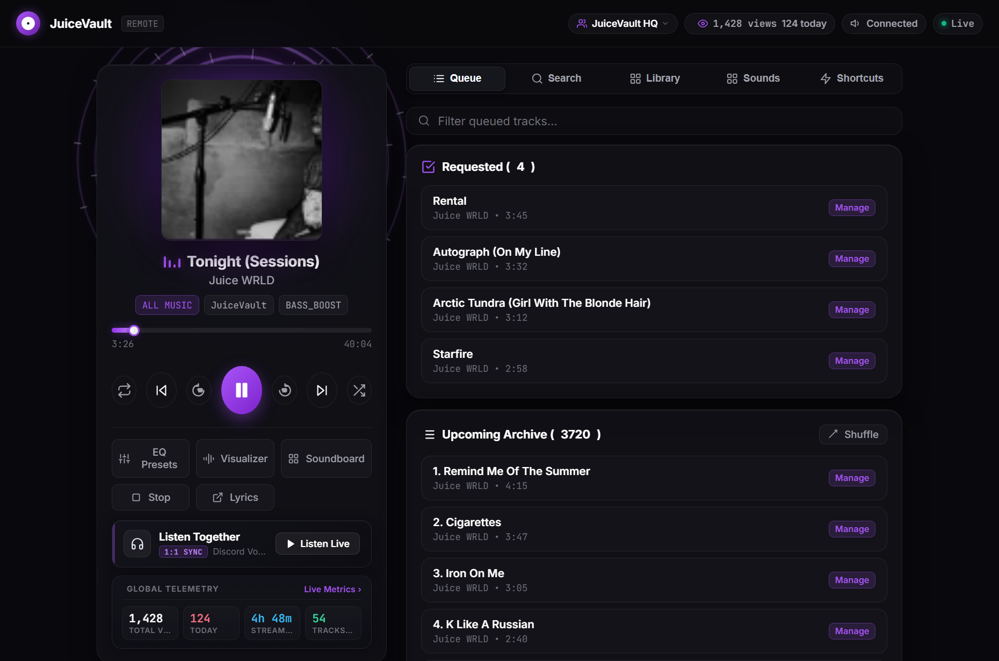
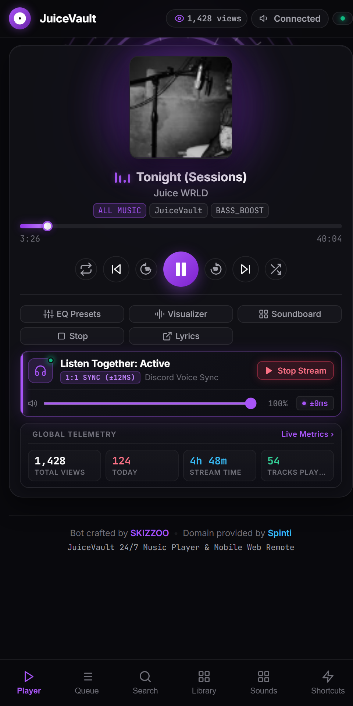
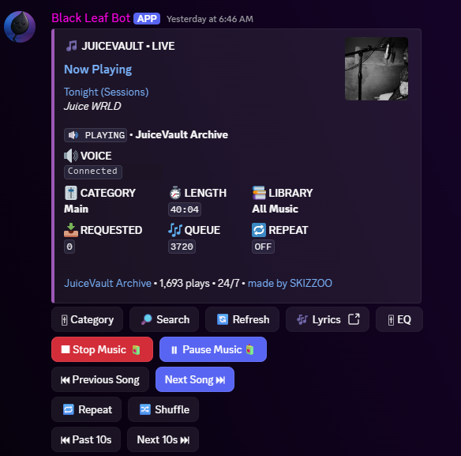

# Red JuiceVault 🧃

[](https://github.com/Cog-Creators/Red-DiscordBot)
[](https://www.python.org/)
[](LICENSE)
[](https://sosocial.lol/ski)
[](https://sosocial.lol/spinti)

A high-performance, polished 24/7 JuiceVault music player and companion Mobile Web Remote for [Red-DiscordBot](https://github.com/Cog-Creators/Red-DiscordBot).

Featuring a **mobile-first PWA controller**, **1:1 phase-locked audio streaming ("Listen Together")**, an interactive **50 Meme Soundboard**, **live audio EQ presets (8D, Bass Boost, Nightcore)**, **YouTube playlist support**, and **automated Cloudflare Tunnel HTTPS**.

---

## 📸 Showcase & Preview







---

## ✨ Key Features

### 🎧 "Listen Together" (1:1 Discord Phase-Locked Audio Sync)
- **1:1 Real-Time Audio Streaming**: Listen to the exact song playing in Discord directly on your phone or computer browser.
- **Phase-Locked Loop (PLL) Engine**: Sub-30ms clock synchronization ensures your browser audio plays in lockstep with Discord voice channel members with zero echo.
- **Live Hardware Volume Slider & Micro-Steering**: Smooth dynamic pitch and rate adjustments keep audio perfectly aligned without stuttering.
- **Lock Screen Media Player**: Full integration with the iOS / Android `MediaSession` API allows play, pause, skip, and scrubbing directly from your lock screen, notification center, or Apple Dynamic Island.

### 🌌 10-Preset Audio-Reactive Visualizer Engine
- **Dynamic Cover Art Aura**: Reactive coronal glow, vinyl aura, and radiant frequency pulses pulsating directly behind the rotating album cover.
- **Ambient Background Visualizer**: Full-screen canvas modes including *Ambient Aurora Waves*, *Quantum Starfield*, *Retro Synthwave Grid*, and *Hyperdrive Warp Tunnel*.
- **Hardware DSP Analysis**: Built-in Web Audio API FFT frequency analyzer (Cyber Neon Bars, Phosphor Oscilloscope, dual ballistic Analog VU Meters) with harmonic rhythm synthesis.
- **Custom Sensitivity & Opacity**: In-app slider adjustments with persistent local configuration.

### ⌨️ Hardware Media Controls & Gaming Mouse Support
- **Keyboard Media Keys**: Native OS media key capture (`MediaPlayPause`, `MediaTrackNext`, `MediaTrackPrevious`, `MediaStop`), including keyboard shortcuts like `Fn + F11`, `F10`, `F12`, and `Spacebar`.
- **Gaming Mouse Media Buttons**: Direct support for gaming mice side buttons (e.g. Razer Viper V3 Hyperspeed buttons 4 & 5 / auxiliary clicks) mapped to play/pause and queue skipping.
- **Bluetooth & Lock Screen Integration**: Continuous playback control from Bluetooth headphones, AirPods, and steering wheel media buttons.

### 📊 24/7 Global Telemetry & Streaming Analytics
- **24/7 Background Tracking**: Playback time, hourly listening activity curves, and songs completed are tracked persistently round-the-clock directly from Discord voice, ensuring metrics match and accumulate even when the website is closed.
- **Sleek Broadcasting Telemetry Sheet**: Real-time traffic counter (total views, daily visits, unique visitors, active WebSocket sessions) paired with 24-hour hourly distribution and all-time statistics.

### 🔊 50 Meme Soundboard
- **50 Curated Viral Sounds**: Instant soundboard pads (Airhorn, OOF, Bruh, Yeet, Sad Trombone, Wow, etc.) from MyInstants.
- **Smart Music Ducking / Auto-Pause**: When any soundboard pad is triggered, current music playback pauses instantly, plays the soundboard effect into the voice channel, and seamlessly resumes the music.
- **Audio Previews**: Optional local audio preview checkbox lets you audition sounds directly on your device.

### 📱 Mobile Web Remote PWA
- **Compact & Modern Layout**: Streamlined, ultra-responsive dark glassmorphic UI optimized to fit cleanly on mobile screens without horizontal overflow or excessive scrolling.
- **1-Tap Pairing**: Instant QR Code pairing generated from Discord with secure auth tokens.
- **Installable PWA**: Tap *Add to Home Screen* in Safari (iOS) or Chrome (Android) for a standalone fullscreen mobile app with custom app icons.
- **Live WebSocket Sync**: Real-time 60fps playback scrubber, live soundwave visualizer, and dynamic status badges.
- **Full Queue Management**: Tap any track to play immediately, move next, or remove from queue.

### 🌐 Cloudflare Tunnel & Custom Domains
- **Named Tunnel Support**: Connect your own custom domain (e.g. `https://remote.juicevault.space`) with automated background service recovery.
- **1-Click Quick Tunnel**: Instant temporary `https://*.trycloudflare.com` URL with zero router configuration or port forwarding needed.
- **Direct HTTPS**: Optional built-in 2048-bit self-signed SSL generator for open port deployments.

### 🎚️ Dynamic Audio EQ & Effects
- **Real-Time Audio Presets**: Flat, Bass Boost, 8D Audio (orbital panning), Nightcore (1.22x pitch/tempo), Slowed (0.86x reverb), Echo, Wide Stereo, and Virtual Sub-Bass.
- **Web Remote EQ Processing**: Built-in Web Audio API filter graph applies audio effects to both Discord voice and your phone stream simultaneously.

### 🎵 Music Engine & Search
- **24/7 Continuous Playback**: Endless archive playback from JuiceVault collections (All Music, Instrumentals, Remasters, Stems, Released, Cut Files).
- **YouTube Playlists & Search**: Search any online song or paste full YouTube playlists to queue all tracks automatically via `yt-dlp`.
- **Requested Queue Priority**: User requests always play ahead of the background archive stream.
- **VIP User Auto-Greeting**: Automated 3-second delayed greeting video with auto-resume when designated VIP users join the voice channel.
- **Offline Disk Cache Resilience**: Automatic atomic disk caching prevents downtime during upstream archive API outages.

---

## 🕹️ Discord Commands

Prefix: `[p]` (e.g. `4jv` or `!jv`)

### Player & Playback
```text
[p]jv start                       # Start 24/7 archive playback
[p]jv stop                        # Stop playback and leave voice
[p]jv play <query | URL>          # Play external song or full YouTube playlist
[p]jv skip                        # Skip current track
[p]jv previous                    # Play previous track from history
[p]jv skip10                      # Jump forward 10 seconds
[p]jv rewind10                    # Jump backward 10 seconds
[p]jv shuffle                     # Shuffle current archive queue
[p]jv status                      # Display current player status
[p]jvpanel                        # Open interactive Discord button control panel
```

### Mobile Web Remote & Tunnel
```text
[p]jv remote                             # Display remote link, token, and scannable QR Code
[p]jv remote url <https://your.domain>   # Bind a custom domain (e.g. https://remote.juicevault.space)
[p]jv remote tunnel token <token>        # Start persistent Cloudflare Named Tunnel with token
[p]jv remote tunnel                      # Start free 1-click Cloudflare Quick Tunnel (*.trycloudflare.com)
[p]jv remote tunnel stop                 # Stop active Cloudflare tunnel
[p]jv remote tunnel clear                # Remove saved tunnel token and stop tunnel
[p]jv remote https [on|off]              # Toggle self-signed direct HTTPS on your port
[p]jv remote port <port>                 # Change web server port (default: 8088 or 2556)
[p]jv remote token [new_token]           # View or regenerate secret auth token
[p]jv remote restart                     # Restart web remote server
```

### Library & Collections
```text
[p]jv categories                  # List available archive categories
[p]jv category <name>             # Switch active collection (e.g. Released, Instrumentals)
[p]jv search <query>              # Search JuiceVault archive and queue track
[p]jv refresh                     # Clear cache and refresh track catalog
```

---

## 🚀 Installation

### 1. Requirements
- Python 3.9+
- [Red-DiscordBot V3](https://github.com/Cog-Creators/Red-DiscordBot)
- [FFmpeg](https://ffmpeg.org/download.html) installed and in your system `PATH`.

### 2. Add and Load Cog
```text
[p]repo add juicevault https://github.com/SKIZZOO/red-juicevault
[p]cog install juicevault juicevault
[p]load juicevault
```

### 3. Start Playing
Join a voice channel and run:
```text
[p]jv start
```

### 4. Open Mobile Web Remote
```text
[p]jv remote
```
Scan the QR code with your smartphone camera to launch the controller!

---

## 🛠️ Tech Stack & Dependencies

- **[Red-DiscordBot](https://github.com/Cog-Creators/Red-DiscordBot)** — modular Discord bot framework.
- **[discord.py](https://github.com/Rapptz/discord.py)** — Discord voice & client integration.
- **[aiohttp](https://github.com/aio-libs/aiohttp)** — asynchronous Web Remote HTTP server & WebSocket gateway.
- **[yt-dlp](https://github.com/yt-dlp/yt-dlp)** — YouTube playlist & external audio resolution.
- **[cloudflared](https://github.com/cloudflare/cloudflared)** — zero-config Cloudflare Quick & Named Tunnel connector.
- **[FFmpeg](https://ffmpeg.org/)** — audio decoding, filtering, and real-time DSP effects.
- **[OriginKit & Kinetics CSS]** — responsive, physics-based glassmorphic web interface.

---

## 👤 Credits & Contributors

- **Bot Developer**: **SKIZZOO**
  - Website: [sosocial.lol/ski](https://sosocial.lol/ski)
  - GitHub: [@SKIZZOO](https://github.com/SKIZZOO)
- **Domain & Infrastructure**: **Spinti**
  - Website: [sosocial.lol/spinti](https://sosocial.lol/spinti)
  - Generously provided the `juicevault.space` custom domain and network hosting.

Special thanks to the **JuiceVault** team, **Red-DiscordBot** contributors, and the **discord.py** community.

---

## 📄 License

This project is licensed under the [MIT License](LICENSE).
